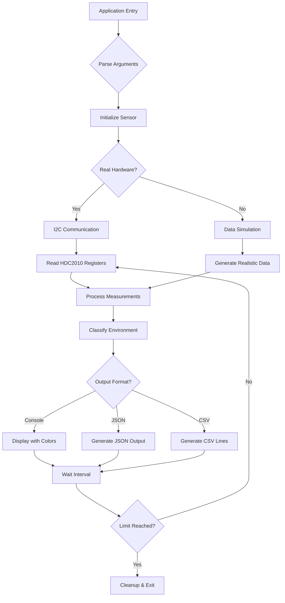

# HDC2010 Environmental Sensor Project

[](https://github.com/yourusername/hdc2010-sensor)
[](https://opensource.org/licenses/MIT)
[](https://www.linux.org/)
[](https://en.wikipedia.org/wiki/C_(programming_language))
[](https://www.ti.com/product/HDC2010)

A professional-grade C application for reading temperature and humidity data from the Texas Instruments HDC2010 environmental sensor. The application supports both real hardware interaction and realistic data simulation modes, making it ideal for development, testing, and production environments.

##  Table of Contents
- [Features](#-features)
- [Architecture](#-architecture)
- [Hardware Setup](#-hardware-setup)
- [Installation](#-installation)
- [Usage](#-usage)
- [Output Formats](#-output-formats)
- [Project Structure](#-project-structure)
- [Build System](#-build-system)
- [API Documentation](#-api-documentation)
- [Examples](#-examples)
- [Troubleshooting](#-troubleshooting)
- [License](#-license)

##  Features

- **Dual Operation Modes**
  - Real HDC2010 sensor integration via I2C
  - Realistic random data simulation for development
  - Automatic fallback to simulation if hardware not detected

- **Multiple Output Formats**
  - Console display with colored output
  - JSON for machine parsing
  - CSV for spreadsheet integration
  - Customizable formats

- **Advanced Functionality**
  - Environmental condition classification
  - Configurable measurement intervals
  - Graceful shutdown handling
  - Signal capture (SIGINT, SIGTERM)
  - Continuous or limited sampling modes

##  Architecture



##  Hardware Setup

### HDC2010 Sensor Connection
```
Raspberry Pi/BeagleBone        HDC2010 Sensor
    3.3V (Pin 1)   ----------   VDD (Pin 8)
    GND  (Pin 6)   ----------   GND (Pin 4)
    SDA  (Pin 3)   ----------   SDA (Pin 5)
    SCL  (Pin 5)   ----------   SCL (Pin 6)
```

### I2C Enablement
```bash
# Enable I2C on Raspberry Pi
sudo raspi-config
# Navigate to Interface Options → I2C → Enable

# Verify I2C detection
sudo i2cdetect -y 1
# Should show device at address 0x40 (HDC2010 default)
```

##  Installation

### Prerequisites
```bash
# Ubuntu/Debian
sudo apt-get update
sudo apt-get install build-essential libi2c-dev

# Raspberry Pi OS
sudo apt-get update
sudo apt-get install build-essential libi2c-dev
```

### Build from Source
```bash
# Clone repository
git clone https://github.com/yourusername/hdc2010-sensor.git
cd hdc2010-sensor

# Clean previous builds (optional)
make clean

# Build the project
make

# Install system-wide (optional)
sudo make install
```

##  Usage

### Basic Operations
```bash
# Run with default settings (simulation mode)
./build/hdc2010_app

# Run with real hardware (requires sensor)
./build/hdc2010_app -r

# Display help
./build/hdc2010_app -h
```

### Command Line Options
| Option | Argument | Description | Default |
|--------|----------|-------------|---------|
| `-m` | `console\|json\|csv` | Output format | `console` |
| `-i` | milliseconds | Sampling interval | `2000` |
| `-c` | count | Number of samples (0=continuous) | `0` |
| `-r` | - | Use real hardware (if available) | `false` |
| `-o` | filename | Output file (for json/csv modes) | `stdout` |
| `-v` | - | Verbose output | `false` |
| `-h` | - | Display help message | - |

##  Output Formats

### Console Output
```
╔════════════════════════════════════════════════════════╗
║                HDC2010 Environmental Sensor            ║
╠════════════════════════════════════════════════════════╣
║ Status:    SIMULATION MODE                             ║
║ Time:      2024-01-15 14:30:45                         ║
║ Temperature: 22.5°C (72.5°F)   [COMFORTABLE]           ║
║ Humidity:    45.2% RH          [OPTIMAL]               ║
║ Dew Point:  10.1°C                                    ║
╚════════════════════════════════════════════════════════╝
```

### JSON Output
```json
{
  "sensor": "HDC2010",
  "mode": "simulation",
  "timestamp": "2024-01-15T14:30:45Z",
  "temperature": {
    "celsius": 22.5,
    "fahrenheit": 72.5,
    "status": "COMFORTABLE"
  },
  "humidity": {
    "relative": 45.2,
    "status": "OPTIMAL"
  },
  "dew_point": 10.1
}
```

### CSV Output
```
timestamp,temp_c,temp_f,humidity,dew_point,temp_status,hum_status
2024-01-15 14:30:45,22.5,72.5,45.2,10.1,COMFORTABLE,OPTIMAL
```

##  Project Structure
```
hdc2010_project/
├── src/
│   ├── main.c              # Application entry point
│   ├── hdc2010.c           # Sensor driver implementation
│   ├── hdc2010.h           # Sensor driver interface
│   ├── utils.c             # Utility functions
│   └── utils.h             # Utility function declarations
├── include/
│   └── hdc2010_registers.h # Register definitions
├── build/                  # Build output directory
├── Makefile               # Build configuration
├── LICENSE                # MIT License
└── README.md             # This file
```

##  Build System

### Available Make Targets
```bash
make              # Build the project
make clean        # Remove build artifacts
make debug        # Build with debug symbols
make release      # Build with optimizations
make install      # Install system-wide
make uninstall    # Remove installed files
make docs         # Generate documentation
```

### Cross-compilation
```bash
# For Raspberry Pi (example)
make CC=arm-linux-gnueabihf-gcc
```

##  API Documentation

### Core Functions
```c
// Initialize sensor
hdc2010_status_t hdc2010_init(bool use_real_hardware);

// Read temperature and humidity
hdc2010_status_t hdc2010_read(float *temperature, float *humidity);

// Calculate dew point
float calculate_dew_point(float temperature, float humidity);

// Classify environmental conditions
env_status_t classify_temperature(float temp_c);
env_status_t classify_humidity(float humidity);
```

### Data Structures
```c
typedef struct {
    float temperature_c;
    float temperature_f;
    float humidity;
    float dew_point;
    env_status_t temp_status;
    env_status_t hum_status;
    time_t timestamp;
} sensor_data_t;

typedef enum {
    SENSOR_OK,
    SENSOR_ERROR,
    SENSOR_NOT_FOUND,
    SENSOR_BUSY
} hdc2010_status_t;
```

##  Examples

### Example 1: Continuous Console Monitoring
```bash
# Monitor every 3 seconds continuously
./build/hdc2010_app -i 3000 -m console
```

### Example 2: JSON Data Logging
```bash
# Log 100 samples to file with 1-second intervals
./build/hdc2010_app -m json -i 1000 -c 100 -o sensor_data.json
```

### Example 3: CSV for Data Analysis
```bash
# Generate CSV for import into spreadsheet
./build/hdc2010_app -m csv -i 5000 -c 50 -o measurements.csv
```

### Example 4: Real Hardware with Verbose Output
```bash
# Use real sensor with detailed output
sudo ./build/hdc2010_app -r -v -i 2000
```

##  Troubleshooting

### Common Issues

**1. Permission Denied for I2C**
```bash
# Solution: Add user to i2c group
sudo usermod -aG i2c $USER
# Log out and log back in
```

**2. Sensor Not Detected**
```bash
# Check I2C bus
sudo i2cdetect -y 1
# Expected output shows device at 0x40

# Verify connections
# Check voltage (3.3V) and ground
```

**3. Build Errors**
```bash
# Install missing dependencies
sudo apt-get install libi2c-dev
# Or use simulation mode
make clean && make
```

**4. High CPU Usage**
```bash
# Increase sampling interval
./build/hdc2010_app -i 5000  # 5-second intervals
```

### Debug Mode
```bash
# Build with debug symbols
make debug

# Run with debug output
./build/hdc2010_app -v

# Use gdb for detailed debugging
gdb ./build/hdc2010_app
```

##  License

This project is licensed under the MIT License - see the [LICENSE](LICENSE) file for details.

##  Contributing

Contributions are welcome! Please feel free to submit a Pull Request.

1. Fork the repository
2. Create your feature branch (`git checkout -b feature/AmazingFeature`)
3. Commit your changes (`git commit -m 'Add some AmazingFeature'`)
4. Push to the branch (`git push origin feature/AmazingFeature`)
5. Open a Pull Request

##  Acknowledgments

- Texas Instruments for the HDC2010 sensor
- Linux I2C development community
- All contributors and testers

##  Support

For issues, questions, or feature requests:
- Open an issue on GitHub
- Check the [Wiki](https://github.com/yourusername/hdc2010-sensor/wiki) for documentation
- Refer to the [TI HDC2010 Datasheet](https://www.ti.com/product/HDC2010)

---

**Project Maintainer**: SSR
**Version**: 1.0.0  
**Last Updated**: January 2024
